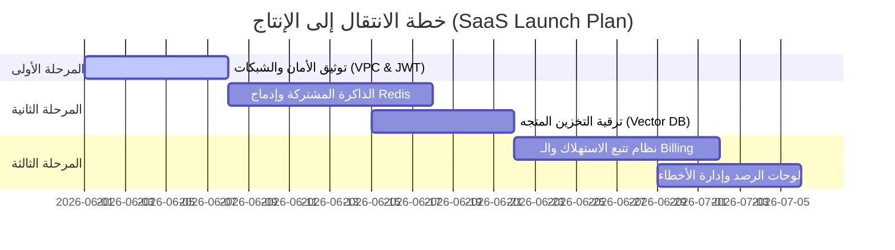

# خطة عمل الانتقال إلى مرحلة الـ SaaS التجاري (Lisan AI SaaS Production Plan)

تهدف هذه الخطة إلى تحويل نظام الذكاء الاصطناعي الحالي (`ai-service`) من مشروع تجريبي (MVP) إلى منصة برمجيات كخدمة (**SaaS**) آمنة، قابلة للتوسع، ومربحة تجارياً ومستعدة للتشغيل الفعلي بالكامل.

---

## 1. الأهداف الاستراتيجية للإنتاج
* **التأمين الكامل (Enterprise Security)**: حماية الخدمة من الاختراقات واستنزاف الحصص عبر التوثيق المتين.
* **قابلية التوسع اللانهائي (Infinite Scaling)**: تحويل الذاكرة والمخزن المؤقت إلى طبقة موزعة لمنع فقدان البيانات عند التوسع.
* **الربحية والتحكم بالتكلفة (LLM Cost Control)**: تتبع استهلاك الموارد بالدقة القصوى وربطها بنظام دفع تلقائي.
* **الاعتمادية العالية (High Availability)**: معالجة حالات الفشل التلقائي للنماذج وضمان عدم انقطاع الخدمة عن المشتركين.

---

## 2. مراحل الخطة التنفيذية (SaaS Phases)

---

### المرحلة الأولى: الأمان وحماية البنية التحتية (Security & Auth)
> [!IMPORTANT]
> حماية خوادم الـ AI من الوصول المباشر هي الأولوية القصوى لمنع سرقة الـ API Keys أو استهلاكها من أطراف خارجية.

#### الإجراءات الفنية:
1. **مصادقة JWT المزدوجة**:
   - عدم الاعتماد على سر خطي ثابت. بدلاً من ذلك، ستقوم الخدمة بالتحقق من الـ JWT Tokens الصادرة من Firebase مباشرة للتأكد من هوية المستخدم وصلاحيته.
2. **عزل الشبكة (VPC & API Gateway)**:
   - وضع الـ `ai-service` في شبكة فرعية خاصة (Private Subnet).
   - لا يمكن الوصول إليها إلا من خلال خادم الويب (Express Backend) أو بوابة تطبيق آمنة (Reverse Proxy مثل Nginx أو AWS API Gateway).
3. **التكامل المشفر**:
   - تفعيل بروتوكول HTTPS في جميع قنوات الاتصال البينية.

---

### المرحلة الثانية: بنية هندسية موزعة وقابلة للتوسع (Architecture Scaling)
> [!WARNING]
> البنية الحالية تعتمد على ذاكرة الخادم المؤقتة (In-Memory). في بيئة الإنتاج الفعلي، ستضيع بيانات الجلسات عند زيادة عدد خوادم التشغيل (Auto-scaling).

#### الإجراءات الفنية:
1. **طبقة كاش موزعة باستخدام Redis**:
   - استبدال الـ `RESPONSE_CACHE_MANAGER` المحلي بمخزن كاش خارجي سريع (**Redis**).
   - توحيد الـ `EXACT_RESPONSE_CACHE` لجميع خوادم التطبيقات المشغلة بالتوازي.
2. **مستودع الجلسات الموزع (Distributed Memory)**:
   - نقل ذاكرة المحادثة لتعمل من خلال Redis مع تحديد زمن انتهاء صلاحية تلقائي للجلسة (TTL) لتوفير المساحة وتجنب تراكم البيانات غير النشطة.
3. **ترقية استرجاع البيانات (Vector DB Layer)**:
   - دمج قاعدة بيانات متجهات سحابية مثل **Qdrant** أو **Pinecone** لحفظ Transcripts والبحث الفوري دلالياً بدلاً من قراءة الملفات من القرص الصلب.

---

### المرحلة الثالثة: نظام التحكم بالتكاليف والفوترة (Cost Control & Billing)
> [!TIP]
> نماذج SaaS القائمة على الذكاء الاصطناعي يجب أن تراقب استهلاك كل مستخدم (بـ الميكرو-سنت) لضمان الربحية وعدم تجاوز تكاليف التشغيل لقيمة الاشتراكات.

#### الإجراءات الفنية:
1. **تتبع استهلاك الـ Tokens لكل مستخدم (Metered Tracking)**:
   - إنشاء جدول استهلاك في قاعدة البيانات الرئيسية (Postgres/Firestore) يسجل المدخلات والمخرجات لكل مستخدم بالتفصيل:
     $$\text{Total Cost} = (\text{Input Tokens} \times \text{Input Rate}) + (\text{Output Tokens} \times \text{Output Rate})$$
2. **الربط مع بوابة الدفع Stripe**:
   - إعداد الباقات (Tiers) بحدود استهلاك شهرية مرنة (مثال: 5$ شهرياً تمنح المستخدم 200,000 Token).
   - تفعيل إيقاف الحساب التلقائي (Hard Limit) عند تجاوز سقف الباقة لإيقاف استنزاف الحسابات.
3. **تحسين الحصص الديناميكي**:
   - تطبيق خوارزميات تقليص السياق التلقائي (Context Truncation) للحفاظ على أقل عدد ممکن من الـ Tokens في كل استفسار.

---

### المرحلة الرابعة: الرصد، المتابعة، والجهوزية العالية (Monitoring & HA)
#### الإجراءات الفنية:
1. **لوحة تتبع وتحليل الأداء الذكي**:
   - ربط الـ `ai-service` بمنصة رصد ومراقبة متخصصة للـ LLM مثل **Helicone** أو **Portkey** لمشاهدة الاستهلاك والأخطاء مباشرة.
2. **آلية تخطي الأخطاء المتقدمة (Circuit Breaker Automation)**:
   - تحسين قنوات الانتقال السريعة في حال تعطل Gemini بالكامل عبر التوجيه التلقائي المباشر إلى Claude أو OpenAI مع إرسال إشعارات فورية لمهندسي النظام عبر Slack أو PagerDuty.
3. **فحص سلامة النظام السحابي (Production Health Checks)**:
   - إعداد الـ Uvicorn ليعمل داخل حاويات Docker المشغلة تحت Kubernetes أو AWS ECS لضمان إعادة التشغيل الفوري والآمن لأي مثيل يتعطل.

---

## 3. تكلفة التشغيل المتوقعة والتسعير لنموذج الـ SaaS (تقديري)

| الباقة | السعر الشهري | المزايا | الحد الأقصى من الاستهلاك المدعوم | هامش الربح المتوقع |
| :--- | :--- | :--- | :--- | :--- |
| **المبتدئ (Lite)** | $4.99 | وصول للمستويات الأساسية، توجيه ذكي للتحيات | 150K Input / 50K Output Tokens | **~75%** |
| **المتقدم (Premium)** | $14.99 | فحص النطق الصوتي المتقدم بالذكاء الاصطناعي | 500K Input / 200K Output Tokens | **~65%** |
| **المدارس/المؤسسات** | مخصص | حسابات متعددة للطلاب والأساتذة ولوحات تحكم | غير محدود (استهلاك مرن) | **~80%** |
