# ליסאן — מדריך הפעלה ומסירה לעמותת ליסאן

> גרסת PDF להדפסה: [Lisan-Handover-He.pdf](https://github.com/jce-kehila-2026/kehila2026-lisan/blob/main/docs/handover/Lisan-Handover-He.pdf)
> · חזרה ל־[[Home]]

**כתובת המערכת:** <https://lisan-238bb.web.app>

מדריך זה נכתב עבור הצוות של עמותת ליסאן. הוא מיועד למי שתפעיל את המערכת
ביום־יום — ולא נדרש בו שום ידע טכני.

---

## 1. הקדמה

### מטרה

ליסאן היא אפליקציית אינטרנט ללימוד עברית לדוברות ערבית. התלמידה מתרגלת מילים
במשחקים, משוחחת עם מורה־בינה־מלאכותית ברמה שלה, ומתאמנת על דיבור בהקלטה קולית.

### קהל היעד

| מי | מה היא עושה במערכת |
|---|---|
| **התלמידה** | לומדת: משחקי מילים, שיחה עם ליסאן, תרגול דיבור |
| **המורה** | מלווה תלמידות, בודקת שיחות ומעלה חומרי לימוד |
| **המנהלת (רכזת העמותה)** | פותחת חשבונות, מנהלת הרשאות ועוקבת אחרי הפעילות |

---

## 2. דרישות מערכת

| נושא | הדרישה |
|---|---|
| התקנה | **אין** — הכול עובד בדפדפן |
| דפדפן | כרום, אדג' או ספארי בגרסה עדכנית |
| אינטרנט | חיבור פעיל נדרש |
| מיקרופון | נדרש רק לתרגול דיבור, ורק לאחר אישור בדפדפן |
| שפות | עברית וערבית (ניתן להחליף בכל מסך) |
| מכשירים | מחשב, טאבלט וטלפון |

---

## 3. הוראות התקנה

**אין מה להתקין.** נכנסים לכתובת <https://lisan-238bb.web.app> ומתחברים.

### הוספת המערכת למסך הבית בטלפון

1. פתחי את הכתובת בדפדפן של הטלפון.
2. לחצי על תפריט השיתוף של הדפדפן.
3. בחרי **"הוספה למסך הבית"**.

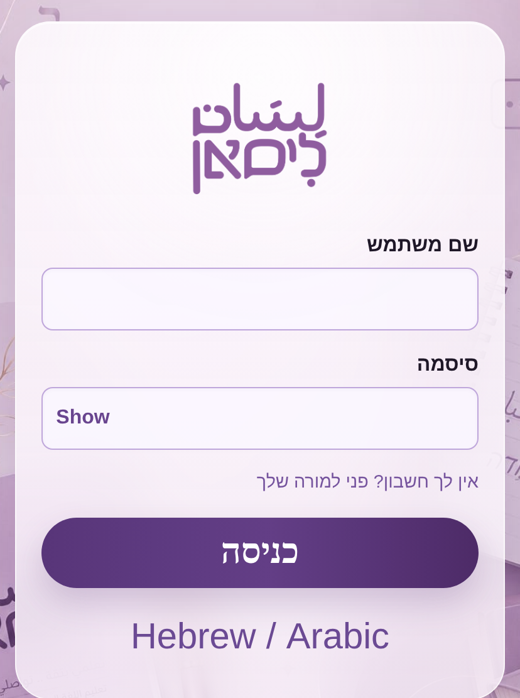

### מי מחלקת חשבונות

אין הרשמה עצמית. **המנהלת** פותחת חשבון לכל תלמידה ולכל מורה, ומוסרת לה את
האימייל והסיסמה הזמנית.

---

## 4. הוראות למשתמש

### 4.1 מנהלת המערכת

זהו החלק החשוב ביותר — כאן מתוחזקת המערכת אחרי המסירה.

#### כניסה למערכת

1. פתחי את <https://lisan-238bb.web.app>.
2. הזיני את האימייל בשדה **שם משתמש**.
3. הזיני את הסיסמה.
4. לחצי על **כניסה**.

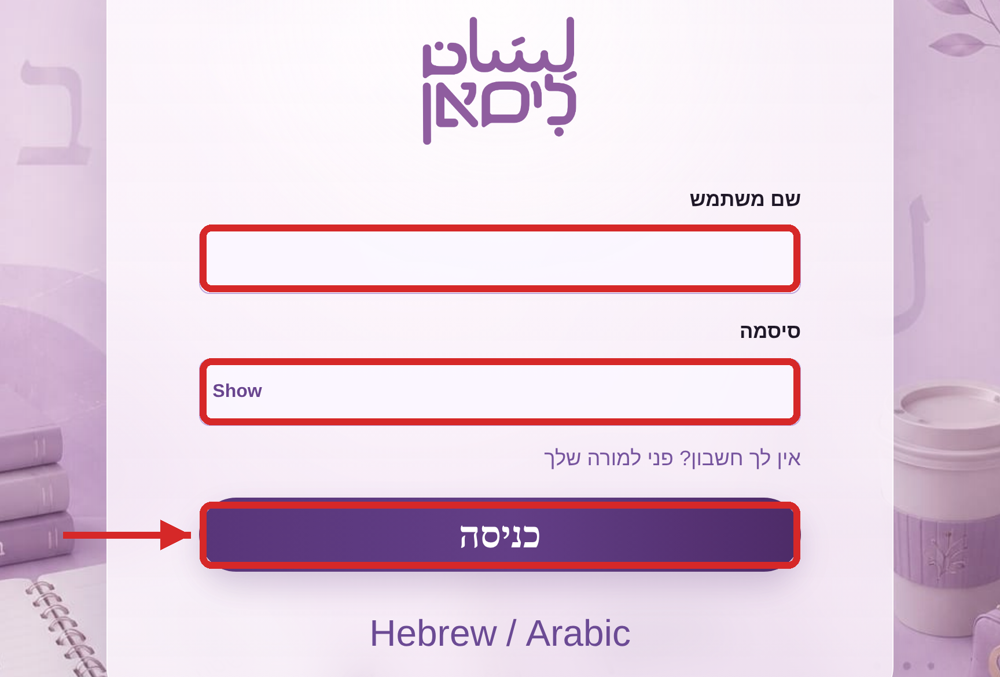

#### פרטי חשבון המנהלת

מלאי כאן את פרטי החשבון שנמסר לעמותה, ושמרי עותק במקום מוגן:

| פרט | הערך |
|---|---|
| **אימייל** | ____________________ |
| **סיסמה** | ____________________ |
| **נמסר בתאריך** | ____ / ____ / ________ |

#### חזרה מתצוגת התלמידה

אחרי הכניסה נפתח אזור הניהול מעצמו — אין צורך לנווט לשם.

בסרגל העליון יש כפתור **תצוגת תלמיד**, שמראה איך המערכת נראית לתלמידה.
מהמסך הזה לא ברור איך חוזרים לניהול — וזו הדרך:

1. לחצי על **מצב מורה** בפינה השמאלית העליונה.
2. אזור הניהול נפתח מחדש.

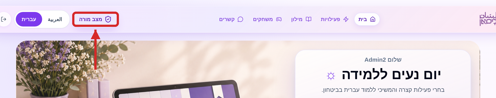

#### איפה נמצאים מסכי הניהול

בשורה העליונה של אזור הניהול יש חמש לשוניות:

| הלשונית | למה היא משמשת |
|---|---|
| **תלמידות** | פתיחה, עריכה, השהיה ומחיקה של תלמידות |
| **מורות** | פתיחת מורות ומנהלות, ושיוך תלמידות למורה |
| **שיחות** | קריאה ואישור של שיחות התלמידות עם ליסאן |
| **מילים** | אישור מילים חדשות שנכנסות לאוצר המילים |
| **חומרים** | העלאת חומרי תרגול |

#### הוספת תלמידה חדשה

1. לחצי על הלשונית **תלמידות**.
2. לחצי על **הוספת תלמידה**.

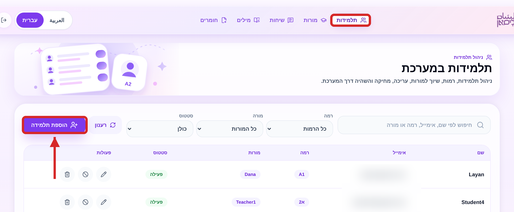

3. מלאי **שם התלמידה**, **אימייל**, **סיסמה זמנית** ו**רמת לימוד**.
4. בחרי מורה אחת או יותר בשדה **בחרי מורות**.
5. לחצי על **הוספת תלמידה**.
6. מסרי לתלמידה את האימייל והסיסמה הזמנית.

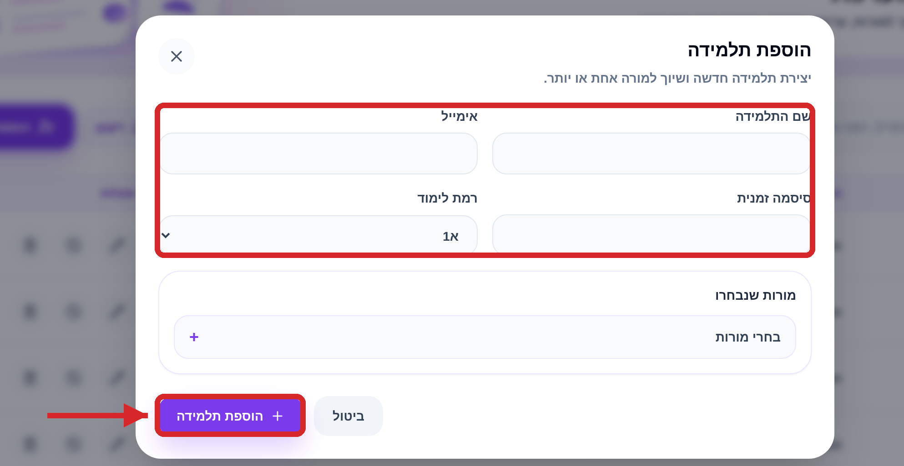

#### עריכת תלמידה ושיוך למורה

1. בשורה של התלמידה לחצי על סמל **העיפרון**.
2. עדכני שם, אימייל או רמת לימוד לפי הצורך.
3. כדי לשייך אותה למורה — בחרי בשדה **מורות שנבחרו**.
4. כדי לשנות סיסמה — הזיני סיסמה חדשה. שדה ריק משאיר את הסיסמה כפי שהיא.
5. לחצי על **שמירת שינויים**.

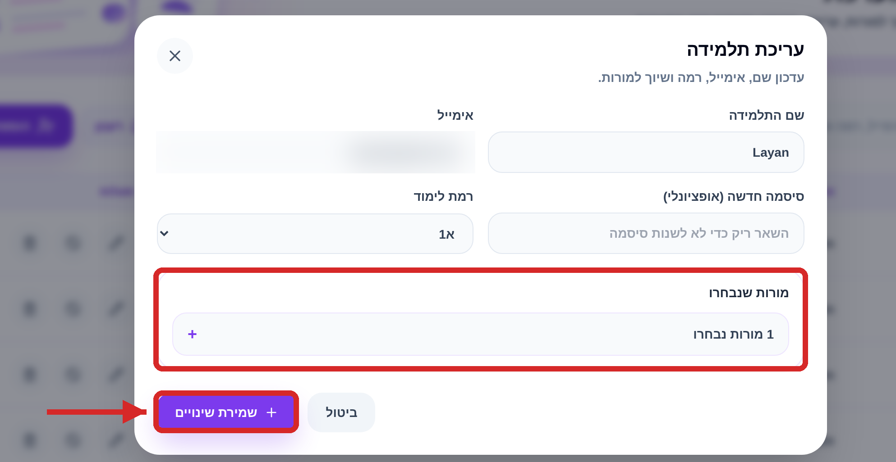

#### השהיה או מחיקה

בעמודת **פעולות** יש שלושה סמלים:

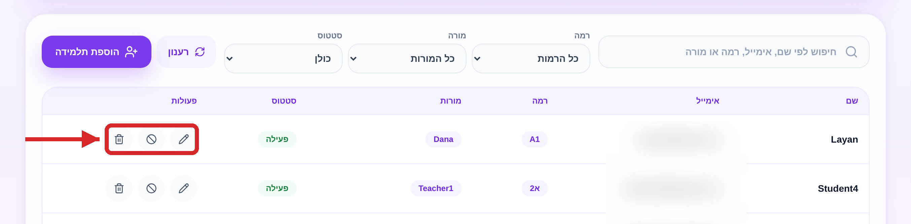

| הסמל | הפעולה | מה קורה |
|---|---|---|
| עיפרון | עריכה | פותח את טופס העריכה |
| עיגול חסום | **השהיה** | התלמידה לא יכולה להיכנס, אך החשבון והנתונים נשמרים |
| פח | **מחיקה** | החשבון נמחק לצמיתות |

**כלל אצבע:** תלמידה שהפסיקה ללמוד — **השהי**. מחיקה שמורה למקרים שבהם
צריך להסיר את החשבון לגמרי, והיא אינה הפיכה.

1. ללחיצה על **פח** ייפתח חלון אישור.
2. לחצי על **מחיקת תלמידה** כדי לאשר, או **ביטול** כדי לחזור.

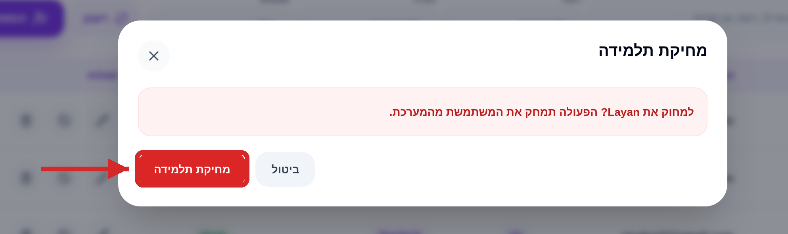

> **מה נמחק ומה נשאר**
>
> המחיקה מסירה את חשבון התלמידה ואת פרטיה האישיים — שם, אימייל, רמת לימוד
> ושיוך למורה. היא **אינה** נוגעת בחומרי הלימוד של המערכת: המילים, התרגילים
> והתכנים נשארים כפי שהם.
>
> ⚠️ **אך שימו לב:** השיחות שהתלמידה ניהלה עם ליסאן וההקלטות הקוליות שלה
> **נשארות שמורות במאגר גם אחרי מחיקת החשבון**. מחיקת החשבון אינה מוחקת
> אותן. אם תלמידה מבקשת שהמידע האישי שלה יוסר במלואו — יש לפנות לצוות
> הפיתוח (פרטים בסעיף 6), כי הסרה כזו אינה אפשרית מתוך המסכים.

#### אישור מילים חדשות

1. לחצי על הלשונית **מילים**.
2. עברי על המילים הממתינות.
3. בחרי **רמה** לכל מילה.
4. לחצי **אישור** כדי להכניס אותה לאוצר המילים, או **דחייה**.

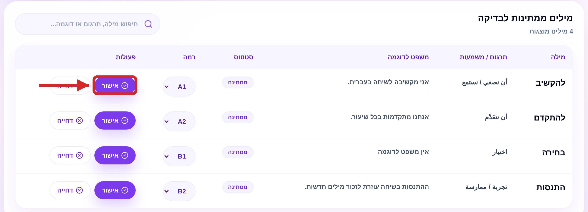

#### בדיקת שיחות

1. לחצי על הלשונית **שיחות**.
2. לחצי **צפייה / בדיקה** ליד השיחה שברצונך לקרוא.
3. קראי את היסטוריית השיחה.
4. אפשר לכתוב **הערות מנהלת** לשימוש פנימי.
5. לחצי **אישור** או **דחייה**.

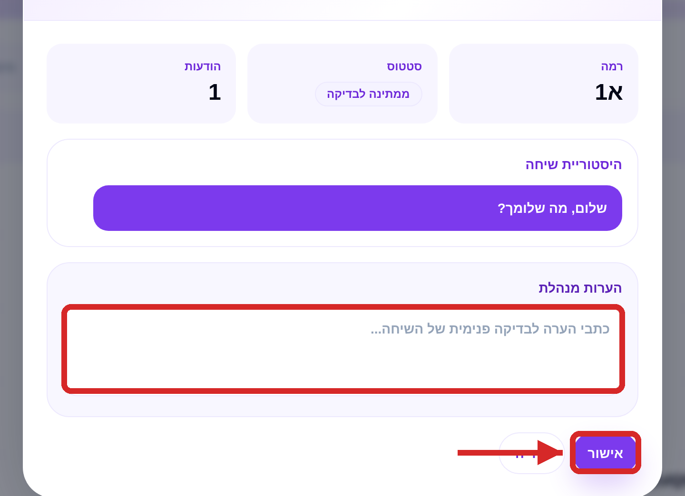

#### מעקב אחרי התקדמות

1. בלוח הבקרה לחצי על **צפייה בניתוח הנתונים המלא**.
2. בחרי את הלשונית **התקדמות**.
3. אפשר לסנן לפי תאריכים או לחפש תלמידה מסוימת.

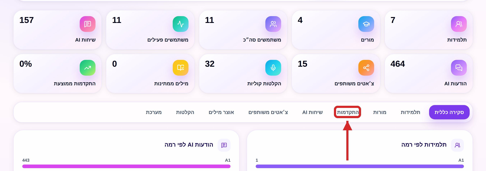

---

### 4.2 ניהול הרשאות

יש שלושה סוגי חשבונות:

| סוג החשבון | מה מותר לה |
|---|---|
| **תלמידה** | ללמוד בלבד: משחקים, שיחה עם ליסאן ותרגול דיבור |
| **מורה** | כל מסכי הניהול: תלמידות, מורות, שיחות, מילים וחומרים |
| **מנהלת** | אותן הרשאות כמו מורה — זהו החשבון האחראי על תפעול המערכת |

> **חשוב לדעת:** במערכת כפי שהיא נמסרת, **מורה ומנהלת רואות בדיוק את אותם
> מסכי ניהול**. ההבדל הוא בתפקיד ובאחריות, לא בהרשאות הטכניות.

#### פתיחת חשבון מורה או מנהלת

1. לחצי על הלשונית **מורות**.
2. לחצי על **הוספת משתמש**.

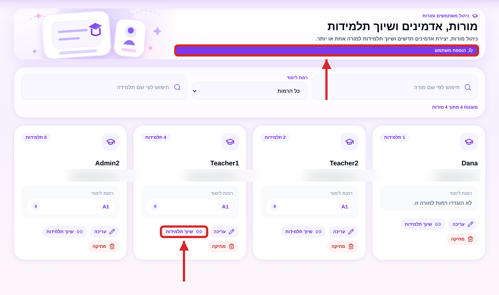

3. מלאי **שם**, **אימייל** ו**סיסמה**.
4. בשדה **תפקיד** בחרי **Teacher** (מורה) או **Admin** (מנהלת).
5. לחצי על **יצירת משתמש**.

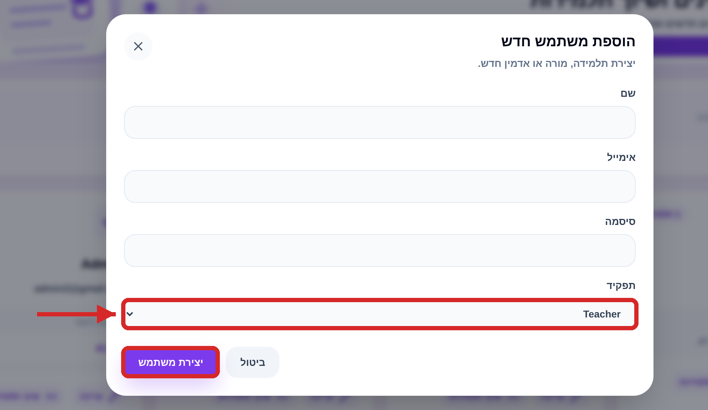

#### שינוי רמת הרשאה של מישהי קיימת

1. בלשונית **מורות**, לחצי **עריכה** בכרטיס שלה.
2. שני את שדה **תפקיד**.
3. לחצי על **שמירת שינויים**.

#### שיוך תלמידות למורה

בכרטיס של המורה לחצי **שיוך תלמידות**, סמני את התלמידות ולחצי **שמירת שיוך**.
אפשר גם לשייך מתוך טופס עריכת התלמידה (סעיף 4.1).

> ⚠️ **שמרו על סיסמת המנהלת.** אין במערכת שחזור סיסמה עצמאי, וחשבון חדש
> נפתח רק מתוך חשבון קיים בעל הרשאת ניהול. אם תאבד הגישה לכל החשבונות
> הללו — לא ניתן יהיה לפתוח חשבונות חדשים ללא עזרת מפתחת.

---

### 4.3 מורה

#### לוח הבקרה

מיד אחרי הכניסה נפתח לוח הבקרה, ובו מספר התלמידות, המורות והשיחות הממתינות
לבדיקה.

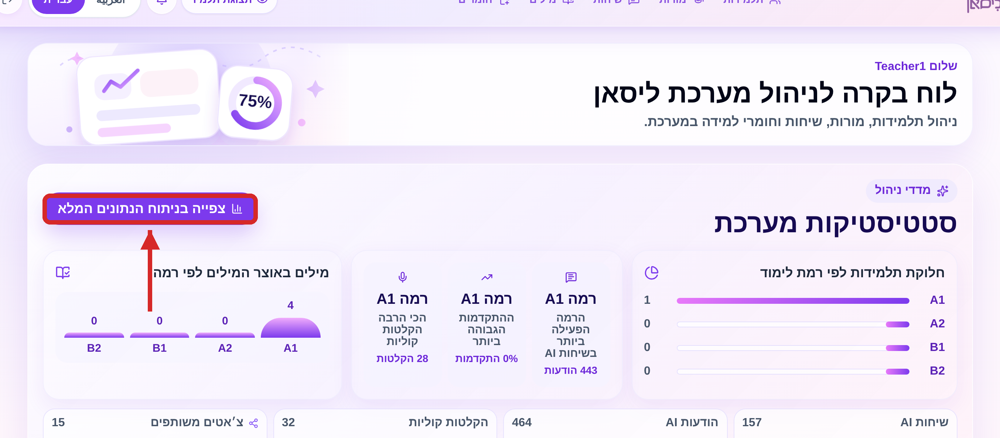

#### בדיקת משובי שיחות

1. פתחי את מסך **משובי שיחות**.
2. סנני לפי **ממתינות**, **אושרו**, **נדחו** או **הכול**.
3. לחצי **אשר** או **דחה** לכל משוב.

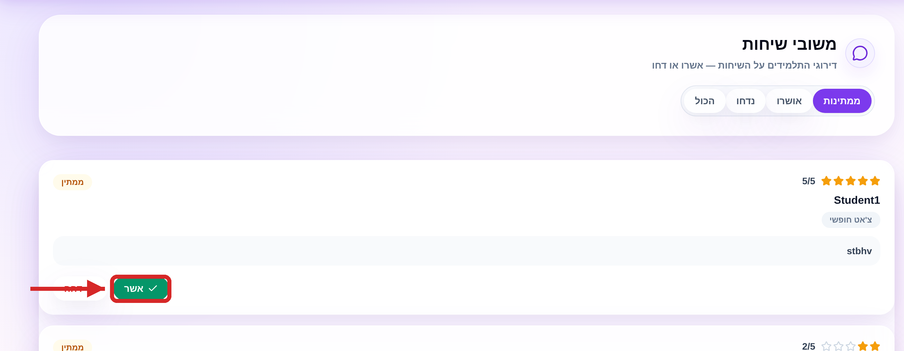

#### העלאת חומרי תרגול

1. לחצי על הלשונית **חומרים**.
2. לחצי על אזור ההעלאה ובחרי קובץ שמע (WAV, MP3 או M4A).
3. המערכת מפיקה תמלול אוטומטי וממירה אותו לחומר תרגול.

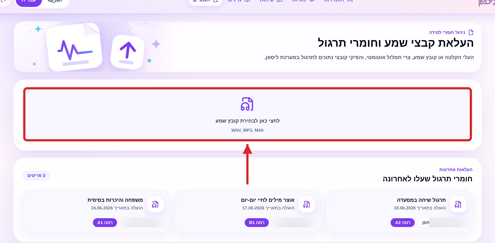

---

### 4.4 תלמידה

מסלול הלמידה פשוט ואינו דורש תחזוקה מצד העמותה.

**דף הבית** — רצף הלמידה, ההתקדמות וקיצור דרך לשיחה עם ליסאן.

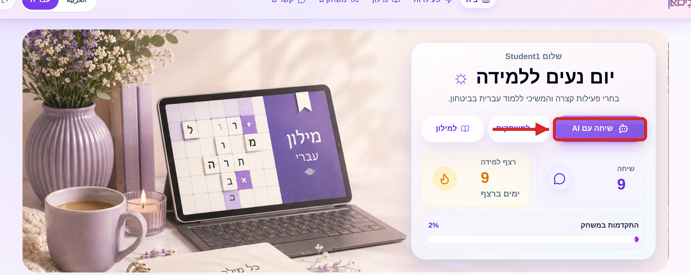

**משחקי מילים** — בחירת קטגוריה, תרגול כרטיסיות וסיום בבוחן קצר.

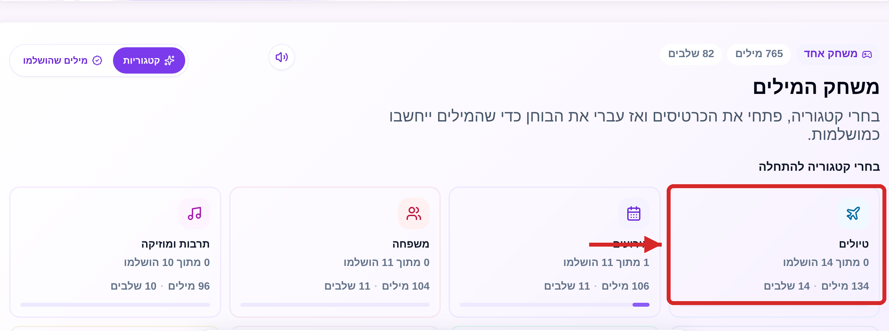

**שיחה עם ליסאן** — כתיבה בעברית וקבלת תשובה ברמת התלמידה. כפתור **הודעה
קולית** מאפשר לדבר במקום לכתוב, וכפתור **הסבר בערבית** מוסיף תרגום.

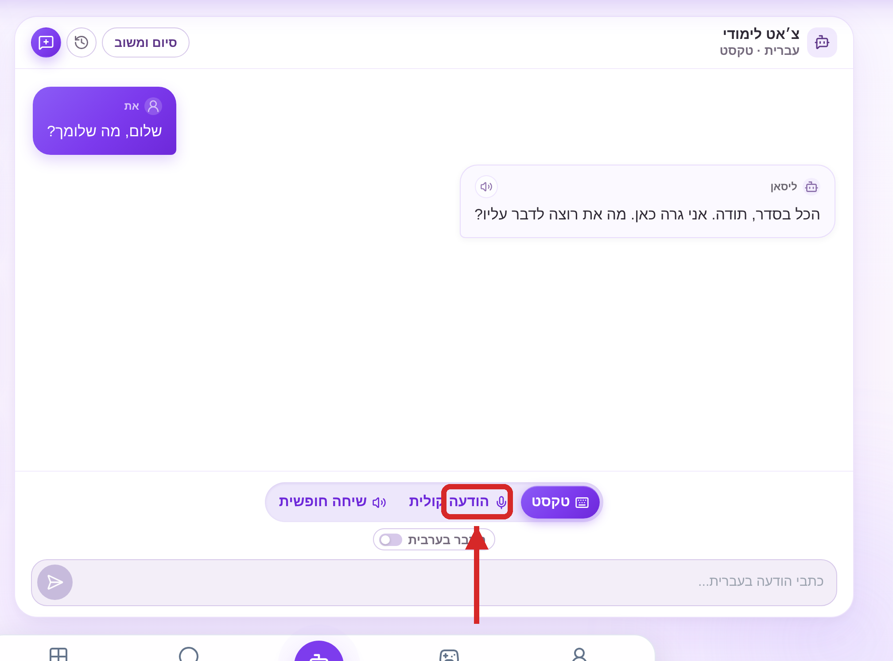

---

## 5. שאלות נפוצות ופתרון בעיות

**התלמידה לא מצליחה להיכנס.**
בדקי בלשונית **תלמידות** שהחשבון קיים ושהסטטוס שלו **פעילה** ולא **מושהית**.
אם שכחה את הסיסמה — פתחי את טופס העריכה והזיני לה סיסמה חדשה.

**המערכת מבקשת קוד גישה כשנכנסים לניהול מורות.**
הקוד הוא **0000**. אפשר גם לדלג על החלון הזה לגמרי: לחיצה על הלשונית
**מורות** בסרגל העליון פותחת בדיוק את אותו מסך, בלי לבקש קוד.

**ליסאן עונה לאט או מתנצלת במקום לענות.**
המערכת עובדת על מכסה חינמית של שירותי הבינה המלאכותית. כשהמכסה נגמרת
מתקבלת תשובה מנומסת במקום תשובה לימודית. יש להמתין ולנסות שוב מאוחר יותר.

**ליסאן אומרת שהשאלה אינה ברמה של התלמידה.**
זו התנהגות מכוונת. הצ'אט נעול בכוונה לאוצר מילים למתחילות כדי לא להציף את
התלמידה. לעיתים הוא מחמיר מדי — אפשר לנסח את השאלה מחדש במילים פשוטות יותר.

**ההקלטה הקולית לא עושה כלום.**
הדפדפן לא קיבל אישור למיקרופון. יש לאשר את בקשת המיקרופון, או לפתוח את
הגדרות האתר בדפדפן ולאפשר גישה למיקרופון.

**ההקלטה הראשונה איטית מאוד.**
בפעם הראשונה בכל מפגש הדפדפן מוריד את רכיב זיהוי הדיבור. ההקלטות הבאות מהירות.

**אין משוב על ההגייה.**
משוב ההגייה דורש שירות בתשלום שאינו מופעל כרגע. שאר תרגול הדיבור עובד כרגיל.

**אין קול בתשובות של ליסאן.**
הקראת התשובות מופקת במכשיר של התלמידה. במכשירים ובדפדפנים מסוימים אין קול
עברי מותקן — התשובה תוצג ככתב בלבד.

**ההתקדמות של תלמידה לא מופיעה במסך הנתונים.**
ההתקדמות נרשמת רק אחרי שהתלמידה סיימה את הבוחן של אחת הרמות במשחק המילים.

---

## 6. תמיכה

**איש קשר לתמיכה**

אנס עכארי — <Anasakkari04@gmail.com> — 052-595-7712

**צוות הפיתוח**

אנס עכארי (ראש צוות) · תלא חרבאווי · עבדאללה אחמרו (סקראם מאסטר) ·
מוחמד סלאמה · ליאן רבאע

**קישורים**

| מה | לאן |
|---|---|
| המערכת החיה | <https://lisan-238bb.web.app> |
| הקוד והתיעוד | <https://github.com/jce-kehila-2026/kehila2026-lisan> |
| הוויקי | <https://github.com/jce-kehila-2026/kehila2026-lisan/wiki> |

---

## נספח טכני — למפתחים בלבד

המערכת בנויה משלושה שירותים:

1. **ממשק המשתמש** — אפליקציית React המתארחת ב-Firebase Hosting.
2. **שרת הביניים** — שרת Express המטפל בהתחברות, בהרשאות ובקריאה/כתיבה ל-Firestore.
3. **שירות הבינה המלאכותית** — שירות FastAPI המריץ שרשרת ספקים
   `Gemini → Anthropic → OpenAI`, אחזור מידע (RAG) מתוך תמלילי A1/A2, מנגנוני
   בטיחות, זיהוי דיבור (Whisper) והערכת הגייה אופציונלית (Azure).

**מאגר הקוד:** <https://github.com/jce-kehila-2026/kehila2026-lisan>

**הרשאות:** נתיבי `/api/admin/*` מוגנים ב-`requireRole('admin','teacher')` —
ולכן `teacher` ו-`admin` מקבלים גישה זהה לכל מסכי הניהול.

**קוד הגישה `0000`:** הקוד קבוע בקוד המקור של הממשק
(`frontend/src/pages/admin/Dashboard.jsx`) ו**אינו אמצעי אבטחה** — הוא חוסם
רק את הקיצור מלוח הבקרה, בעוד הלשונית **מורות** מנווטת לאותו מסך בלעדיו,
וכל בדיקת ההרשאות האמיתית מתבצעת בשרת. יש להסירו או להחליפו בבדיקת הרשאה
אמיתית לפני שמסתמכים עליו.

**סודות והגדרות:** כל המפתחות מוגדרים כמשתני סביבה בקובץ `.env` (ראו
`.env.production.example`). השרת נכשל במכוון בעלייה אם חסר משתנה קריטי.

**פריסה:** ראו [DEPLOY.md](../../DEPLOY.md).

**מגבלות ידועות:** ראו [known-limitations.md](../known-limitations.md).
