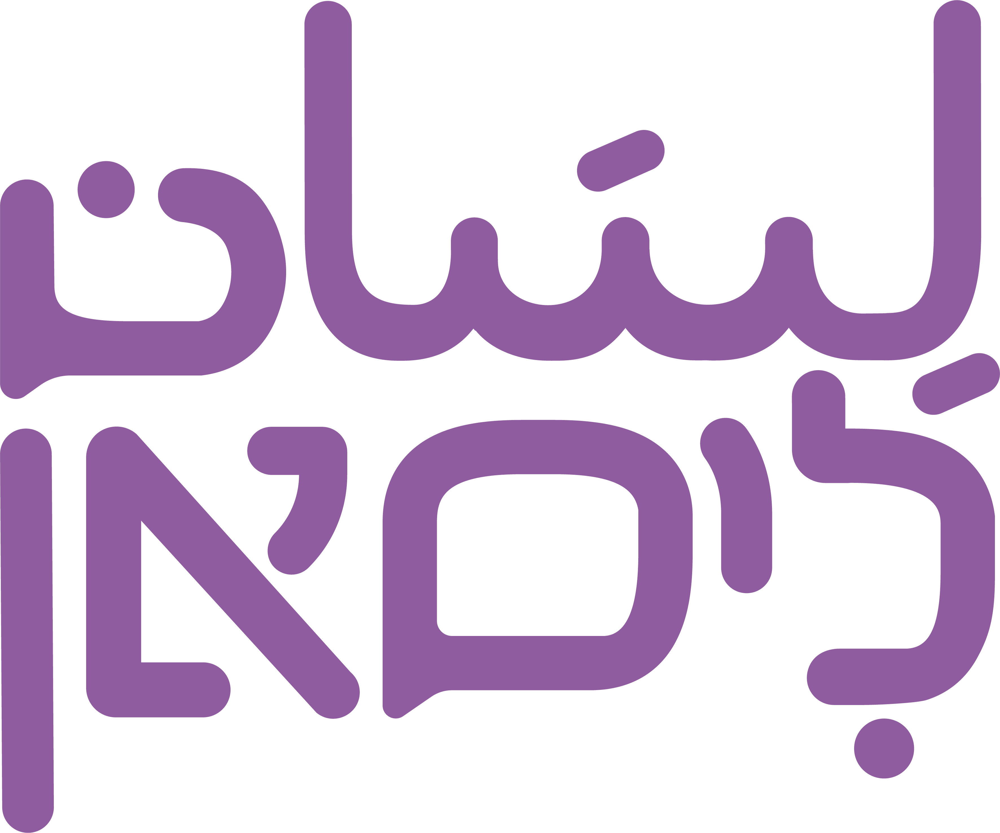

# Lisan — ליסאן
Hebrew learning for Arabic-speaking women.
A beginner-locked AI tutor that stays at the learner's level, explains in her own language, and practises speaking with her.

## Quick Navigation
* [[Handover Guide]] — **מדריך הפעלה ומסירה לעמותה (עברית)**
* [[Project Overview]]
* [[System Requirements]]
* [[Architecture & Design]]
* [[Risk Assessment]]
* [[Use Case Documentation]]
* [[Test Plan]]

## Project Status
Delivered — handed over to עמותת ליסאן, July 2026.

## Key Features
* Word games over a levelled Hebrew vocabulary (A1–B2)
* Chat with an AI tutor locked to the learner's level, with Arabic explanations
* Voice practice: speak instead of typing, with automatic transcription
* Management screens for students, teachers, conversations, vocabulary and materials

## Getting Started
1. Open the live application: <https://lisan-238bb.web.app>
2. **Nonprofit staff:** start with the [[Handover Guide]] — it covers logging in, opening accounts, permissions and troubleshooting, and assumes no technical background.
3. Read the [[Project Overview]] for background information
4. Review the [[System Requirements]] for detailed specifications
5. Understand the system design in [[Architecture & Design]]
6. Review potential risks in [[Risk Assessment]]

## Support
אנס עכארי — <Anasakkari04@gmail.com> — 052-595-7712

## Contact
For any questions or concerns, please open an issue in the GitHub repository.
